# E-commerce CDC Pipeline: Postgres → Debezium → Kafka → Snowflake → dbt

A Change Data Capture pipeline that replicates an operational e-commerce Postgres database to Snowflake in near-real-time, with dbt SCD Type 2 dimensions preserving the full history of customer, product, and pricing changes for analytics. End-to-end latency from RDS commit to Snowflake row visibility is ~5-10 seconds, dominated by the Snowflake Sink Connector's buffer flush interval.

## Architecture

```mermaid
%%{init: {'flowchart': {'rankSpacing': 50, 'nodeSpacing': 30}}}%%
flowchart LR
    Sim["Python<br/>seed + simulator"]
    PG[("Postgres<br/>AWS RDS")]
    DBZ["Debezium 2.7<br/>(Kafka Connect)"]
    KF[("Redpanda<br/>Kafka topics")]
    RAW[("Snowflake RAW<br/>VARIANT JSON")]
    STG[("Snowflake STAGING<br/>typed change streams")]
    MARTS[("Snowflake MARTS<br/>SCD2 dims + fact tables")]

    %% Top row: ingest path, left to right
    Sim -->|writes| PG
    PG -->|"WAL via pgoutput"| DBZ
    DBZ -->|"change events"| KF

    %% Vertical drop into Snowflake
    KF -->|"Snowpipe Streaming<br/>~10s latency"| RAW

    %% Bottom row: dbt transformations, right to left
    RAW -->|"dbt views<br/>parse + dedup"| STG
    STG -->|"dbt tables<br/>SCD2 + PIT joins"| MARTS

    classDef storage fill:#e1f5ff,stroke:#0288d1,stroke-width:2px,color:#000
    classDef compute fill:#fff4e1,stroke:#f57c00,stroke-width:2px,color:#000
    classDef python fill:#f0f0f0,stroke:#666,stroke-width:1px,color:#000
    
    class PG,KF,RAW,STG,MARTS storage
    class DBZ compute
    class Sim python
```



The data flow: synthetic e-commerce data lands in **Postgres on AWS RDS** (the operational source). **Debezium 2.7** reads Postgres's WAL via a logical replication slot and publishes change events to **Kafka topics** (Redpanda). **Kafka Connect** runs both the Debezium source connector and the **Snowflake Sink Connector**, which uses **Snowpipe Streaming** to land change events into Snowflake's `RAW` schema as VARIANT JSON. **dbt** transforms RAW events into staging views, then into SCD Type 2 dimensions and fact tables in `MARTS`, with point-in-time joins preserving historical correctness.

## Why I Built This

This project demonstrates production patterns that show up in both Data Engineer and Analytics Engineer roles: log-based CDC with Debezium, streaming infrastructure with Kafka Connect, dimensional modeling with SCD Type 2, point-in-time fact joins, and comprehensive testing across the stack. Most portfolio projects skip CDC entirely or hand-wave streaming concerns. This one builds them carefully and handles the real operational consequences.

## Tech Stack

- **Postgres on AWS RDS** — simulated operational e-commerce database; chosen over local Postgres for real cloud networking and managed-service experience
- **Debezium 2.7** — industry-standard log-based CDC; chosen over file-polling or trigger-based approaches because it reads the WAL with zero query load on the source DB
- **Redpanda** (Kafka API) — message bus providing durability, replay, and consumer-group decoupling; chosen over Kafka itself for simpler local Docker setup with the same wire protocol
- **Kafka Connect** — managed connector framework hosting both Debezium source and Snowflake sink
- **Snowflake** — cloud warehouse for analytical workloads, with separate compute warehouse for ingestion (`LOAD_WH`) vs analytics (`COMPUTE_WH`) to isolate cost
- **Snowpipe Streaming** (within Snowflake Sink Connector) — sub-15-second ingest latency vs. minute-level file-based Snowpipe
- **dbt 1.11 with dbt-snowflake adapter and dbt_utils** — analytics layer with versioning, tests, and lineage
- **Docker Compose** — local-first development; production deployment would use ECS or Kubernetes for the Connect cluster
- **Python + Faker** — seed data generator and continuous change simulator
- **AWS RDS free tier + Snowflake free trial** — real cloud signal at near-zero cost

## Key Design Decisions

### Manual SCD2 with LEAD/LSN over `dbt snapshots`

dbt's snapshot feature handles SCD2 automatically when configured, but it's designed for polled current-state tables — a periodic SELECT against the source. Our source is a stream of change events with explicit per-event LSN ordering, which is a fundamentally different shape. Writing the SCD2 logic manually with `LEAD(source_ts) OVER (PARTITION BY natural_key ORDER BY lsn)` matched the actual data shape and gave direct visibility into the SCD2 contract — every version's `[valid_from, valid_to)` interval is something I built and tested explicitly rather than something a macro produced.

### Three-role least-privilege Snowflake security

Snowflake permissions aren't strictly hierarchical — table ownership matters, and ACCOUNTADMIN can't always read tables created by other roles. I structured access by responsibility: `CDC_CONNECTOR_ROLE` has INSERT/CREATE on the RAW schema only (the streaming sink's needs); `DBT_DEVELOPER_ROLE` has read on RAW and read-write on STAGING/MARTS (the analytics layer's needs); ACCOUNTADMIN is reserved for setup and emergency intervention only. Following separation-of-duties means a leaked connector credential has a blast radius of one schema instead of the whole account.

### Snowpipe Streaming over file-based Snowpipe

CDC's value proposition is near-real-time analytics; a minute-level ingest layer defeats the purpose. Snowpipe Streaming writes directly to target tables via a Snowflake row-set API (~5-10 second latency end-to-end). File-based Snowpipe stages files and triggers ingest on file arrival — higher throughput but minute-level latency. For our volume, streaming was the right tradeoff. Higher-throughput batch loading would matter at >100K events/sec; we don't need it.

### Raw VARIANT landing, dbt does the parsing

Each Snowflake RAW table has just two columns — `RECORD_METADATA` and `RECORD_CONTENT` as VARIANT JSON — rather than the Sink Connector auto-parsing change events into typed columns. Three reasons: **separation of concerns** (the connector lands bytes durably; dbt gives them business meaning), **deliberate structure** (Debezium events are deeply nested and auto-schematization would flatten them prematurely), and **schema evolution** (when Postgres adds a column, the Sink keeps working unchanged — only the dbt staging model needs updating).

### Single-parse CTE pattern in staging models

Each staging model parses the VARIANT once in a `payload` CTE; downstream CTEs reference the parsed result. Two reasons: performance (Snowflake re-parses on every inline `PARSE_JSON()` call), and maintainability (parse logic lives in one place, so source format changes touch one CTE not twelve column references).

## Production Lessons (Real Bugs This Project Caught)

### The disk-full incident: replication slot WAL retention

I stopped Kafka Connect overnight expecting the pipeline to resume in the morning. Instead, Debezium failed with `Connection refused` to RDS — the instance was in `Storage-full` state. Diagnosis showed the database itself was only 12 MB but total WAL written was 71 GB, and 19 GB of it was retained by my inactive replication slot. The cause: Postgres won't garbage-collect WAL while *any* slot still references it, even if the consumer has disconnected. The slot did exactly what it was designed to do — guarantee no data loss for a returning consumer — and that guarantee filled my disk.

I bought time by upsizing storage 20 → 30 GB to bring the instance back online, dropped the inactive slot, and recreated the connector with a fresh snapshot. For prevention: enabled RDS storage autoscaling, added a CloudWatch alarm at <5 GB free, and changed my operational procedure — never stop the consumer long-term without first dropping the slot, and monitor `pg_replication_slots.confirmed_flush_lsn` lag in production.

Full incident report: [`docs/storage-full-incident-2026-04-29.md`](docs/storage-full-incident-2026-04-29.md)

### The SCD2 snapshot temporal semantics bug

A singular relational integrity test (`fct_orders_no_unmatched_customer`) failed with 5534/5755 orders missing `customer_sk` after the point-in-time join — basically every order that predated the CDC pipeline. Diagnosis traced it back to how `dim_customers` set `valid_from` for snapshot events. The original logic used the snapshot's `source_ts` (when Debezium observed the row) for every event including snapshots. But for snapshots there's no "moment of change" — there's only a "moment of observation." A customer who actually existed in 2024 had a snapshot `valid_from` of 2026-04-28, so any order they placed in 2025 fell before any version of them existed in the dimension and joined to NULL.

The fix: for snapshot rows (`op_type = 'r'`), use the source's `created_at` column as `valid_from` instead.

```sql
CASE
  WHEN op_type = 'r' THEN source_created_at
  ELSE source_ts
END AS valid_from
```

The lesson: SCD2 `valid_from` should represent when the row's state began *in the source*, not when the pipeline observed it. The bug would never have shown up without an explicit relational integrity test — schema tests like `unique` and `not_null` treat NULL `customer_sk` as structurally valid; only a singular semantic test catches "join produced no match."

Full incident report: [`docs/temporal-semantics-fix-2026-05-03.md`](docs/temporal-semantics-fix-2026-05-03.md)

### The seed data integrity bug

After fixing the SCD2 `valid_from` semantics, the same singular test still failed — now with 1175 unmatched orders (down from 5534). Diagnosis traced this to the seed script: `customer.created_at` and `order.placed_at` were generated with independent random distributions, allowing about 20% of orders to be placed *before* their own customer's `created_at` — physically impossible in real e-commerce. The dimensional model rejected these correctly: no version of the customer covers the order's `placed_at` because the customer literally didn't exist yet. The fix constrained order timestamps to respect the invariant.

What makes this the more interesting of the two bugs: in a production CDC pipeline against real data, the same test failure would indicate either genuine source corruption *or* flawed event-time logic in the application — both worth investigating immediately. The synthetic seed bug was a contrived version of a real production failure mode, and the same singular test catches both.

Full incident report: [`docs/seed-data-integrity-2026-05-03.md`](docs/seed-data-integrity-2026-05-03.md)

## Testing Strategy

Three layers of tests across the stack:

1. **Schema tests** (unique, not_null, accepted_values, relationships) — catch structural breakage
2. **Business-rule tests** (`dbt_utils.expression_is_true: ">= 0"` on prices, quantities) — catch semantic breakage that schema alone allows
3. **Singular semantic tests** for invariants that can't be expressed in a column declaration — exactly-one-current-version-per-entity, no-overlapping-validity-intervals, no-orphan-fact-rows

95 tests pass on a clean build. The singular tests caught two real bugs that schema tests would have silently passed.

## Repository Structure

```
ecommerce-cdc/
├── docker/                          # Docker Compose + Connect configs
│   ├── docker-compose.yml           # Redpanda + Kafka Connect + Console
│   ├── debezium-postgres-connector.json
│   ├── snowflake-sink-connector.json
│   └── custom-plugins/              # Snowflake Sink JAR (gitignored)
├── schema/
│   └── 01_create_tables.sql         # Postgres operational schema
├── seed/
│   └── seed_data.py                 # Faker-based initial data
├── simulator/
│   └── change_simulator.py          # Continuous change generator
├── dbt_ecommerce/                   # dbt project
│   ├── models/
│   │   ├── staging/                 # 6 source-aligned staging views
│   │   └── marts/                   # 2 SCD2 dims + 2 fact tables
│   ├── tests/                       # Singular SCD2/relational tests
│   ├── macros/                      # Custom generate_schema_name
│   └── dbt_project.yml
├── snowflake/
│   └── 00_snowflake_setup.py          # Snowflake Setup
├── docs/                            # Architecture diagram + incident reports
└── README.md
```

## Setup

Prerequisites: Docker Desktop, Python 3.10+, an AWS account, a Snowflake account.

1. **Provision RDS Postgres** (free tier db.t4g.micro), enable `rds.logical_replication` via parameter group, create a `dbz_publication FOR ALL TABLES`.
2. 2. **Configure Snowflake**: run `snowflake/00_snowflake_setup.sql` as ACCOUNTADMIN to create database/schemas/warehouses/roles/user. Then generate an RSA key-pair locally and register the public key on KAFKA_CONNECTOR_USER (see file comments).
3. **Clone repo and configure**:
   ```bash
   cp .env.example .env  # fill in RDS + Snowflake credentials
   python -m venv venv && source venv/bin/activate
   pip install -r requirements.txt
   ```
4. **Seed Postgres**: `python seed/seed_data.py`
5. **Download Snowflake Sink JAR**:
   ```bash
   curl -L -o docker/custom-plugins/snowflake-kafka-connector.jar \
     https://repo1.maven.org/maven2/com/snowflake/snowflake-kafka-connector/2.5.0/snowflake-kafka-connector-2.5.0.jar
   ```
6. **Start Docker stack**: `cd docker && docker compose up -d`
7. **Register connectors**:
   ```bash
   set -a; source ../.env; set +a
   envsubst < debezium-postgres-connector.json | curl -X POST -H "Content-Type: application/json" http://localhost:8083/connectors --data @-
   envsubst < snowflake-sink-connector.json | curl -X POST -H "Content-Type: application/json" http://localhost:8083/connectors --data @-
   ```
8. **Build dbt models**:
   ```bash
   cd dbt_ecommerce && dbt deps && dbt build
   ```
9. **Run continuous changes** (optional, for demo): `python simulator/change_simulator.py --rate 2 --duration 600`

## Future Work / Limitations

- **Replication slot lag monitoring in CloudWatch.** Currently relies on the FreeStorageSpace alarm as a downstream symptom; better to monitor the slot directly.
- **Multi-table transaction metadata via Debezium's transaction topic.** Currently each operation is its own change event; `fct_orders` doesn't know that an INSERT into `orders` and 3 INSERTs into `order_items` came from one logical transaction.
- **Generic SCD2 macro.** The `dim_customers` and `dim_products` SQL is structurally identical; could be a Jinja macro to avoid duplication when a third dimension is added.
- **Schema evolution handling.** Currently a Postgres column add requires a manual dbt staging model update. A schema-registry-driven generator would handle this automatically.
- **Sub-second latency tuning.** Current ~10-second latency is dominated by the Sink buffer (`buffer.flush.time: 10`). For sub-second use cases (fraud detection, real-time personalization), tighter buffers and exactly-once semantics would be needed.
- **Production deployment of Connect.** Currently runs on Docker Compose locally. Production would deploy to ECS or Kubernetes with proper monitoring, autoscaling, and dead-letter-queue alerting.
